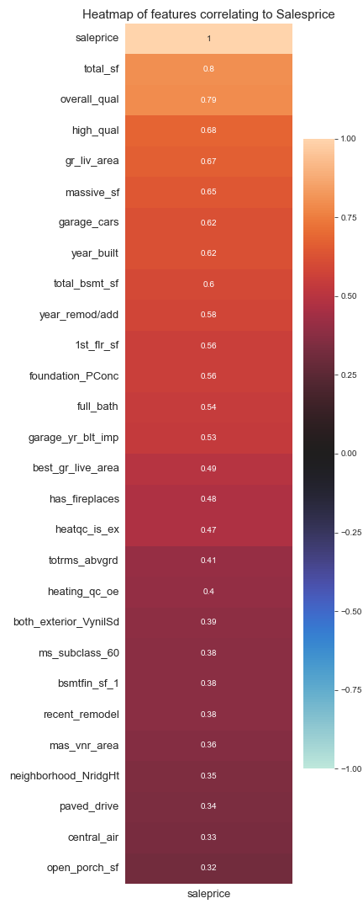
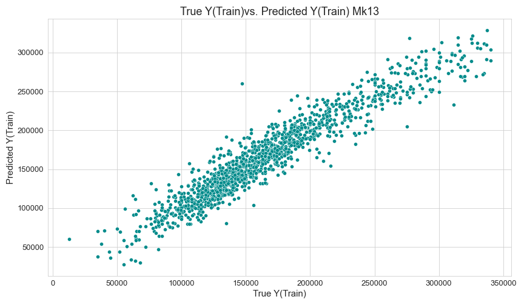

# Salesprice Prediction with Machine Learning

## Executive Summary

## Problem statement

As a data scientist working for real estate company, how can we optimize predicting pricing outcomes for homeowners looking to sell? Whether it’s the homeowner pricing too high, leading their homes unsellable even in good markets or homeowners not maximizing the profits by listing the prices too low. We can optimize the predictions through feature engineering and linear regression so that we can have an R2 score that exceeds a baseline model. We can also gain insights how these features contribute to pricing as well.

### Description of Dataset
The two datasets used for this project are a test and train component of the Ames housing dataset, which was obtained via project lesson plan from the course.
* [`train.csv`](../datasets/train.csv): Ames Housing Data Train Set
* [`test.csv`](../datasets/test.csv):Ames Housing Data Test Set

Data Dictionary can be found *[Here!](http://jse.amstat.org/v19n3/decock/DataDocumentation.txt)*.

## Data Visualizations & Analysis

### Highest Correlated features

This heat map gives us a good look at the features with the highest correlation. Such as 'Overall Quality' being .79, 'Above grade (ground) living area square feet' at .67.  
Others worth noting are:

* Total Square footage: .8
* High Quality: .68
* Massive Square Footage: .65
* Garage Cars: .62
* Year Built: .62
 

### Exploring some relationships with the highest correlated features
 

This is a feature with a high correlation of .79. We can see most of the houses are between a quality rating of 5 and 8.  Data engineered from this feature to create a binary high quality column where we have the quality be at least an 8.
 

Looks like most values in the data set are between 120,000 to a little under 280,000.  This is also a right-skewed distribution as the long tail extends to the right as most values are show on the left side(between 90,000 & 340,000). You can also see a value of 600,000 as an outlier as well.
 

This is a slightly higher than moderate linear relationship, it takes on the shape of a fan. Its correlation is .67.
 

Age of home is a feature that was engineered with a negative correlation, which dictates that the "younger" the home the more the sales price is.
 

A clear relationship that tells us that  greater square footage leads to higher salesprices for homes.
 

Shows us that most garages can fit at least 2 cars.
 

## Finding the right model

Part of finding the right model will involve a few factors, what is the R2 Score?  The R2 indicates how much of the variability in our target is explained by the features in our model. This can help us assess which regression model gives us the best predictions.

Interpreting coefficients can be explained as, for every 1 unit increase of a particular feature, we expect the target to increase by the coefficient amount. For those models that are not scaled, this can be a good way to see how the features contribute from a dollar amount to get insight into what contributes heavily to the sales price of these homes.

Another important aspect to consider is how a model performs in terms of bias-variance.  Typically when a model is high bias, this model is considered underfit. This indicates a model that is bad at predicting a target. Whether its data that it has trained on it or unseen data.  In this case we need to increase variance, and we can do that with complexity of the model, that is adding more features.
On the other hand a high variance model indicates a complicated model that does not do well generalizing to new data.  This can indicate that the model needs to be simplified. An overfit model does well on the data its trained on, but not on the unseen data. We can tackle this issue through regularization(ridge or lasso), or simplifying the model with less features.

Reference
Lesson 3.02 - Regression Metrics

### Model 1

From the cross validation before fitting the model we established a baseline R2 score of 80.27% and 65.59%. There is a drop in the test set score as it does not do as good of a job generalizing to new data. Indicating that the model is overfit and has high variance as its baseline.  When we actually run the model we get scores of 85.28% and 71.53%.  While both scores see an increase the model is still overfit and regularization could help decrease the variance.

### Model 2

Using Ridge we see a minimal difference between the original and the ridge version. Just that the training and test scores are a bit closer together. Original scores were 85.28%(training) and 71.53%(testing) compared to ridge scores of 84.77%(training) and 73.29%(testing).  We can see Ridge had a slightly worse performance with testing and slightly better with training, which also lowered the variance and made it slightly less overfit. It is also worth noting that this was also preprocessed via Standard Scaler, in order to account for the dimensionality differences within these features(such as square footage).Scaling is required so that regularization penalizes each variable equally fairly. This indicates a need for features that are more signal than noise, in order to strengthen the model's overall performance, increasing feature engineering that is guided by the research can help with this.

### Model 3

This model is doing worse than the first model when it comes to generalizing to new data. While the R2 scoring was high on the training data set 94%. R2 can have a negative value when the model is so bad at following the trend of the data that it does worse to fit it than a horizontal line or just picking something at random. The R2 for the test data was --.79%.  It looks like executing the polynomial features on all the existing features did not do the trick, and its back to the drawing board. The next model will also make use of standard scaler since the different dimensions that all these features use could have become way too different in magnitude.

[Reference Here](https://medium.com/analytics-vidhya/is-it-possible-to-have-a-negative-r-square-847a6a4a2fbe)

### Model 4

The previous model was horrible, but by using standard scaler it must have controlled for all the differences in magnitude whether its square footage vs age of the home. Properly scaling the numbers made R2 jump to 87.66% on the training set and 74.39% on the test sit and it outperforms model 1. On the other hand this model is overfit, and will need to use regularization in order to decrease the variance and hopefully get a properly fit model.

### Model 5

When applying the Lasso regularization there is no improvement on the training data or testing data.

### Model 6

This model also deviates from model 4 and when applying the Ridge regression with an optimal alpha, we get a training R2 of 87.49% while the testing R2 is 75.02%.  When we compare it to the Lasso regression model we have a slight decline in improvement from 87.66% to 86.50%, but we have an improvement with the testing as it increases from 74.39% to 75.02%.  This model generalizes slightly better to newer data and has decreased its variance but is still modeling to some of the noise in the data.  While the model is still overfit we are trending in the right direction. If we are to improve the balance of the bias-variance we may have to couple regularization with decreasing complexity of the model.  If we go back to our original baseline model that scored 65.59% for testing data, this latest iteration of the model has increased by about 15 points in accuracy.

### Model 7

Decided to be more selective with the features, and dropped those with extremely low correlations. Once that happened then I applied the polynomial features to it. This has lead to a somewhat slightly underfit model that scores less on training data at 83.08% but scored the highest yet on the testing data with a score of 83.41%.  This model seems to have a bit more bias than any of my previous models, thus it is underfit, and therefore does not need regularization. Also, a model that has been subjected to Standard Scaler. This model does the best job in finding that optimal sweet spot where we are balancing the bias and variance in order to minimize error.
Reference:lesson Bias-Variance

## Up to this point

The initial premise here was to predict a price for a home using a linear regression model that outperforms a baseline model.  After iterating through several models, I selected a Linear Regression model that whittled down features based on very poor correlation.  The following step was to apply both a polynomial features transformation and the standard scaler.  This ended up having the best R2 Score for testing portion of the train-test-split.  It had an R2 score of 83.41% which was an improvement over the baseline of the original model many iterations ago, that baseline had a score of 65.59%.  Thats a shade under an 18 points of improvement in the R2 score.  In other words there was a 65.59% of the variance in our sales price  that could be explained by the features in our model to begin with, and that has improved to 83.41% of the variance/variability in our sales price that could be explained by the features in our model. Also worth noting that the testing RMSE of this model was 32307.37 which is a decrease from the first model RMSE of 43739.88. This can be good because you want RMSE as close to 0 as possible and is in the dollar units of salesprice so in a sense the predicted y is closer to actual y.

| **Model** | **Train RMSE** | **Test RMSE** | **Train R2** | **Test R2** |
|-----------|----------------|---------------|--------------|-------------|
| Model_1   | 29587.55       | 43739.88      |      .85     |     .72     |
| Model_2   | 30098.74       | 42362.35      |      .85     |     .73     |
| Model_3   | 18850.60       | 109767.34     |      .94     |     -.79    |
| Model_4   | 27087.66       | 41485.18      |      .88     |     .74     |
| Model_5   | 27087.68       | 41483.23      |      .88     |     .74     |
| Model_6   | 27270.32       | 40967.73      |      .87     |     .74     |
| Model_7   | 31694.52       | 32307.37      |      .83     |     .83     |

## Revisiting & Retooling
The purpose of revisiting this project via models 8-15 is to show more thoughtfulness in a few areas to see how that impacts our linear regression models:
* Dealing with outliers
* Dealing with Nulls
* Processing the data
* Feature Selection
* Having a DRY approach

### Dealing with Nulls
During the first two notebooks my approach entailed simply dropping nulls, for columns with close to or over 50% nulls I would just drop the column.  Remaining columns with a null presence of about 5% had those rows simply dropped.  This time around I had the same approach where I dropped those columns that had about 50% nulls or higher, but the remaining null values were dealt with differently.  For numerical columns I decided to go with the experimental iterative imputer, and for any other data type went with a simple imputer approach(most frequent).  This allowed for me to have more fleshed out data points, and wanted to see how these changes would impact the model.

### Dealing with Nulls
During the first two notebooks my approach entailed simply dropping nulls, for columns with close to or over 50% nulls I would just drop the column.  Remaining columns with a null presence of about 5% had those rows simply dropped.  This time around I had the same approach where I dropped those columns that had about 50% nulls or higher, but the remaining null values were dealt with differently.  For numerical columns I decided to go with the experimental iterative imputer, and for any other data type went with a simple imputer approach(most frequent).  This allowed for me to have more fleshed out data points, and wanted to see how these changes would impact the model.

### Processing the Data
When processing the data I wanted to really familiarize myself with the features, and noticed how I had not taken into account all the ordinal feature columns.  I decided to transform these columns using ordinal encoding.
While maintaining the variables(paved drive & central air) I had made into binary propositions from my original project work. Then applied "get dummies" to the remaining categorical features that were of the nominal variety.
Also I feature engineered by choosing columns with a high correlation and creating a new column to see whether the value was greater than or equal to the 75th percentile or not.  

### DRY Approach
Another thing I wanted to optimize was the actual workflow and using functions and list comprehensions in order to accomplish repetitive tasks such as when executing my imputing approach, in implementing/fitting a model and running metrics for that model.

### Model 8

This model already works better than any of the initial sets of models I worked on a couple of months back.  Worth noting this model only includes features that correlate with 'salesprice' at greater than or equal to .30.  I can attribute the improvement of just this baseline model to three factors. The way I dealt with null values was to use a combination of iterative imputation & simple imputation.  Dealing with outliers on my target feature by using a formal statistical method(interquartile range method). Another difference is in how I approached ordinal columns, where the values actually had a certain weight difference to them(e.g. excellent, good, bad), where I used an ordinal encoder to transform these columns.  If you compare the original results I used for my baseline model long ago where the Testing R2 Score is .65, this model has a whopping 22 point improvement with an R2 Score of .87.  It also has half RMSE value that our model 7 had, model 8 has an RMSE of 20642.51. The adjusted R2 of .92 also lets me know that the model can afford to add more features which determines how I iterate from here.
 
### Model 9

This model takes into account that the previous model had a higher Adjusted R2 than R2, indicating we can add more features.  This model includes correlating features that are greater than .25.  Testing R2 Jumps up to .88 and the RMSE goes down to 19939.13.  Adjusted R2 will maintain itself at .92 from hereon.  
 
### Model 10

When adding features with a correlation greater than .20, the model continues to improve from the standpoint of RMSE by lowering to 19895.26.  Testing R2 score stays consistent at .88.
 
### Model 11

When adding features with a correlation greater than .15, the model jumps in its Testing R2 score to .89 while lowering its Testing RMSE to 19196.89.
 
### Model 12

This model includes features with correlation greater than .10, this model improves with respect to its Testing R2: .9 and reduces its testing RMSE: 18360.22.
 
### Model 13

For the model that includes features with correlation greater than .05, Testing R2 remains the same and testing RMSE increases to 18397.15.
 
### Model 14

This turns out to be the best performing model because not only does it maintain the R2 score of .9, it has the lowest Testing RMSE at 17984.23.
 
### Model 14 Coefficients

Key insights from the top ten coefficients for the best performing model were the following:
* A house in the neighborhood of Green Hills with all else held constant gets an increase of 102,503.32 while one in Northridge Heights gets an increase of 30,243.25, Northridge increases at 26,121, Veenker increases at 23,702.57.

* Holding all else constant a house whose main exterior material is stone will have an increase in value of 26,330.17, while secondary materials of brick common will increase in value 18,002.22 and brick face 17,896.38.  
* The ms_subclass 70 & 60 indicate 2 story homes that cover 1945 and before as well as 1946 and newer.  All else held constant ms_subclass 70 classified homes have an increase of 21992.12 while ms_subclass 60 have an increase of 20511.62(all else held constant).
 

### Model 15

This is the first of a couple of models I ran where the RMSE began to gradually increase.  Which was a good indication to have this become my stopping point.
 

## Model Metrics(8-15)
|              **Model**             | **Train MSE** | **Test MSE** | **Train RMSE** | **Test RMSE** | **Train R2** | **Test R2** | **Adjusted R2** |
|:----------------------------------:|:-------------:|:------------:|:--------------:|:-------------:|:------------:|:-----------:|:---------------:|
|   Base_line Cross validation mean  |       NA      |      NA      |       NA       |       NA      |      .80     |     .65     |                 |
|  Model_8 Correlated features > .3  |  454556326.22 | 426113318.24 |    21320.33    |    20642.51   |      .87     |     .87     |       .92       |
|  Model_9 Correlated features > .25 |  408688775.06 | 397568963.95 |    20216.05    |    19939.13   |      .88     |     .88     |       .92       |
| Model_10 Correlated features > .20 |  385480212.23 | 395821216.32 |    19633.65    |    19895.26   |      .89     |     .88     |       .92       |
| Model_11 Correlated features > .15 |  375816013.37 | 368520569.34 |    19385.97    |    19196.89   |      .89     |     .89     |       .92       |
| Model_12 Correlated features > .10 |  349035246.53 | 337097661.46 |    18682.49    |    18360.22   |      .9      |      .9     |       .92       |
| Model_13 Correlated features > .05 |  321993966.47 | 338455267.02 |    17944.19    |    18397.15   |      .9      |      .9     |       .92       |
|  Model_14 Correlated features >-10 |  279402217.91 |**323432630.71**|  16715.33    |  **17984.23** |      .92     |    **.9**   |       .92       |
|  Model_15 Correlated features >-25 |  247087410.31 | 325002715.87 |    15719.01    |    18027.83   |      .93     |      .9     |       .92       |

## Conclusion
Initially the results from model 8 which only included features with a correlation of over .3, surpassed anything I did in the first 7 models.  Some key take aways were an improvement to 87% for the testing R2 Score, and being able to halve my testing RMSE from model 1(43,739.88 to 20,642.51).  An additional metric I wanted to evaluate with was the adjusted R2, this is because the fact that the Adjust R2 value was higher than my testing R2 indicated that my models would work well by adding additional features.  This dictated the rest of my approach which peaks with model 14 which not only achieves the highest testing R2 score of .9 but also has the lowest RMSE of 17,984.23. Due to the differences in dealing with nulls, actually dealing with outliers, and processing the data allowed for my features to become more useful in building a model.  There was no need to use polynomial features and because my models were at a good bias variance level, there was no need for regularization either.  When you take into account the initial approach and having a baseline from the cross validation mean for testing at .65, being able to improve the model by 25 points to .9 is substantial.  Also when comparing it to the best performing model(model 7) from the first batch which had a testing R2 score of .83 there is also a 7 point improvement in performance with model 14 having a .9 for its testing R2 score.  

## Next steps
After vastly improving the linear regression model, revisiting the project in the future will entail applying different types of models such as boosting models just to see if there is better performance.  The boosting model may not be as inferential but am curious to performance.
